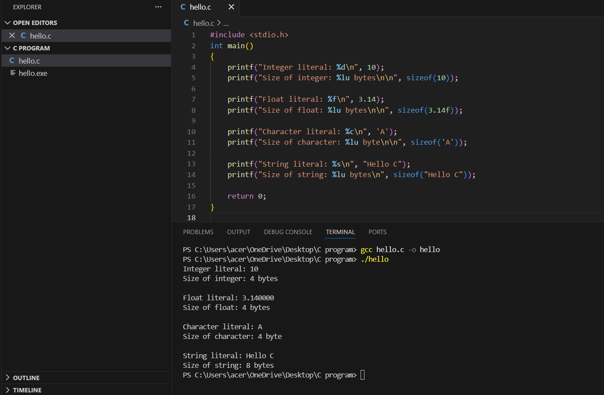
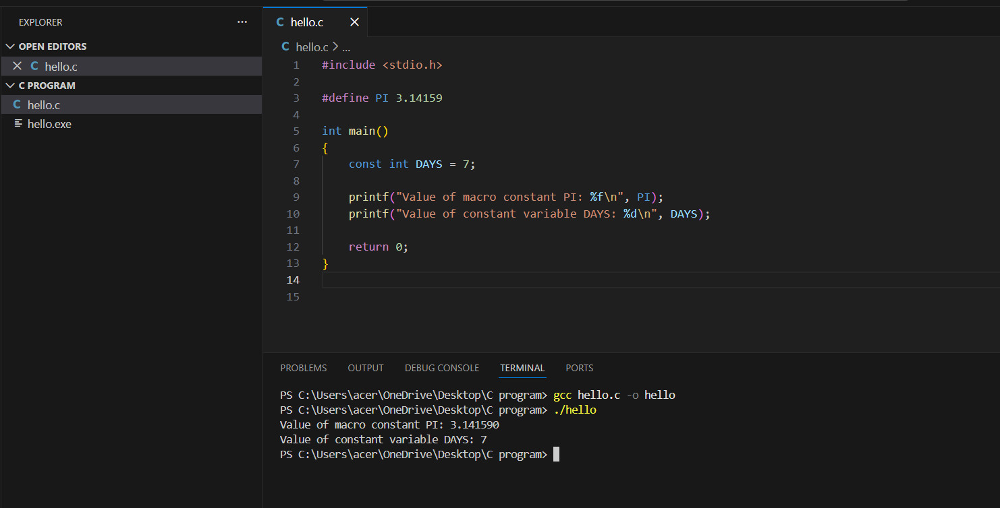
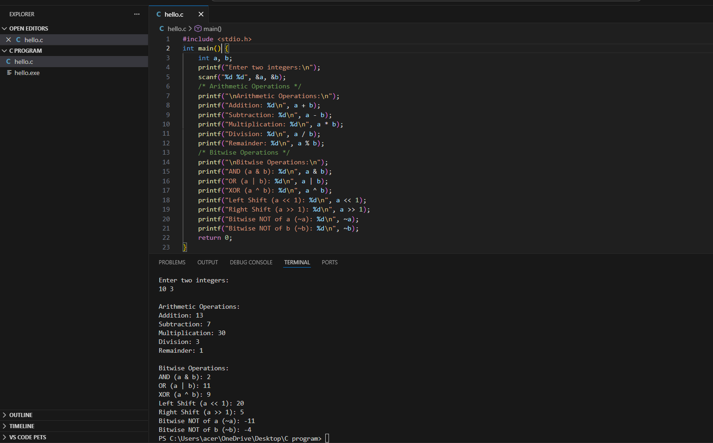
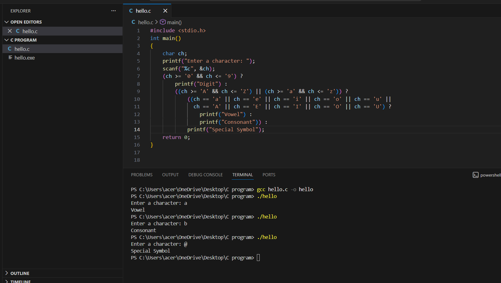

# 19AI304-Fundamentals-of-C-Programming-2025-Odd-M1
# IAPR-1- Module 1 - FoC
## 1. Implementation of basic C programs using Literals,Consonants, Variables, Data types.
## 2. Implementation of different categories of operators.
# Ex.No:1
  Build a C program to demonstrate the usage of different types of literals: integer, float, character, and string.  
# Date : 26-12-25
# Aim:
To build a C program that prints integer, float,character, and string literals on the console using the printf() function.
# Algorithm:
### Step 1:
  Start
### Step 2: 
  Include the standard input-output library: #include<stdio.h>.
### Step 3: 
  Inside the main() function, use printf() to display each literal along with its size in bytes using sizeof() :
  
   3.1 Integer literal (e.g., 10) using `%d`
   
   3.2 Float literal (e.g., 3.14) using `%f`
   
   3.3 Character literal (e.g., 'A') using `%c`
   
   3.4 String literal (e.g., "Hello C") using `%s`
   
### Step 4: 
   Stop
# Program:
```
#include <stdio.h>

int main()
{
    printf("Integer literal: %d\n", 10);
    printf("Size of integer: %lu bytes\n\n", sizeof(10));

    printf("Float literal: %f\n", 3.14);
    printf("Size of float: %lu bytes\n\n", sizeof(3.14f));

    printf("Character literal: %c\n", 'A');
    printf("Size of character: %lu byte\n\n", sizeof('A'));

    printf("String literal: %s\n", "Hello C");
    printf("Size of string: %lu bytes\n", sizeof("Hello C"));

    return 0;
}

```
# Output:



# Result: 
Thus, the program was implemented and executed successfully, and the required output was obtained.


# 19AI304-Fundamentals-of-C-Programming-2025-Odd
# IAPR-1- Module 1 - FoC
# Ex.No:2
  Build a C program to display the value of a macro constant and a constant variable.
# Date : 26-12-25
# Aim:
  To build a C program that demonstrates the use of macro constants and constant variables.
# Algorithm:
### Step 1:
  Start  
### Step 2: 
  Include the standard input-output library: #include<stdio.h>.
### Step 3: 
  Define a macro constant `PI` with value `3.14159` using `#define`.
### Step 4: 
   Inside `main()`:
   
   4.1 Declare a constant integer variable `DAYS`
   
   4.2 Initialize it with the value `7`
   
### Step 5:  
  Use `printf()` to display the values of `PI` and `DAYS`.     
### Step 6:  
  Stop
# Program:
```
#include <stdio.h>

#define PI 3.14159

int main()
{
    const int DAYS = 7;

    printf("Value of macro constant PI: %f\n", PI);
    printf("Value of constant variable DAYS: %d\n", DAYS);

    return 0;
}

```
# Output:



# Result: 
Thus, the program was implemented and executed successfully, and the required output was obtained.


# 19AI304-Fundamentals-of-C-Programming-2025-Odd
# IAPR-1- Module 1 - FoC
# Ex.No:3
  Build a C program to demonstrate the use of different data types such as int, float, double, and char, and display their values using printf().
# Date : 26-12-25
# Aim:
  To build a C program that declares variables of various data types—integer, float, double, and character—initializes them, and prints their values on the screen.
# Algorithm:
### Step 1:
  Start
### Step 2: 
  Include the standard input-output library: #include<stdio.h>.
### Step 3: 
  Inside main(), declare and initialize variables of types int, float, double, and char.
### Step 4: 
   Display their values using printf().
### Step 5:    
   Stop
# Program:
```
#include <stdio.h>

int main()
{
    int a = 10;
    float b = 5.25;
    double c = 12.34567;
    char d = 'C';

    printf("Integer value: %d\n", a);
    printf("Float value: %f\n", b);
    printf("Double value: %lf\n", c);
    printf("Character value: %c\n", d);

    return 0;
}

```
# Output:


# Result: 
Thus, the program was implemented and executed successfully, and the required output was obtained.
# 19AI304-Fundamentals-of-C-Programming-2025-Odd
# IAPR-1- Module 1 - FoC
# Ex.No:4
  Build a C program to perform arithmetic and bitwise operations on two integers entered by the user. The program should display: Arithmetic operations: addition, subtraction, multiplication, division, and remainder. Bitwise operations: AND, OR, XOR, left shift, right shift, and NOT.
# Date : 26-12-25
# Aim:
  To build a C program that takes two integers as input and demonstrates the arithmetic and bitwise operations, displaying the results of each operation.
# Algorithm:
### Step 1:
  Start
### Step 2: 
  Include the standard input-output library: #include<stdio.h>.
### Step 3: 
  Declare two integer variables a and b.
### Step 4: 
   Prompt the user to enter two integers and read the input using scanf().
### Step 5:    
   Perform arithmetic operations on a and b:
   #### Sum (a + b)
   #### Difference (a - b)
   #### Product (a * b)
   #### Quotient (a / b)
   #### Remainder (a % b)
### Step 6: 
  Perform bitwise operations on a and b:
  #### AND (a &amp; b)
  #### OR (a | b)
  #### XOR (a ^ b)
  #### Left shift (a << b)
  #### Right shift (a >> b)
  #### Bitwise NOT of a (~a) and b (~b)
### Step 7:   
  Display the results of all operations using printf().
### Step 8:   
  Stop
# Program:
```
#include <stdio.h>

int main()
{
    int a, b;

    printf("Enter two integers:\n");
    scanf("%d %d", &a, &b);

    /* Arithmetic Operations */
    printf("\nArithmetic Operations:\n");
    printf("Addition: %d\n", a + b);
    printf("Subtraction: %d\n", a - b);
    printf("Multiplication: %d\n", a * b);
    printf("Division: %d\n", a / b);
    printf("Remainder: %d\n", a % b);

    /* Bitwise Operations */
    printf("\nBitwise Operations:\n");
    printf("AND (a & b): %d\n", a & b);
    printf("OR (a | b): %d\n", a | b);
    printf("XOR (a ^ b): %d\n", a ^ b);
    printf("Left Shift (a << 1): %d\n", a << 1);
    printf("Right Shift (a >> 1): %d\n", a >> 1);
    printf("Bitwise NOT of a (~a): %d\n", ~a);
    printf("Bitwise NOT of b (~b): %d\n", ~b);

    return 0;
}

```
# Output:



# Result: 
Thus, the program was implemented and executed successfully, and the required output was obtained.


# 19AI304-Fundamentals-of-C-Programming-2025-Odd
# IAPR-1- Module 1 - FoC
# Ex.No:5
  Develop a C program to check whether a given character is a vowel, consonant, digit, or special symbol using the ternary operator.
# Date : 26-12-25
# Aim:
  To develop and implement a C program that classifies a character as a vowel, consonant, digit, or special symbol using the ternary operator.
# Algorithm:
### Step 1:
  Start
### Step 2: 
  Include the standard input-output library: #include<stdio.h>.
### Step 3: 
  Input a character ch from the user.
### Step 4: 
   Check if ch is a digit ('0' to '9').
   
   If true → Print "Digit" → Go to Step 8.
   
   If false → Go to Step 5.
   
### Step 5:    
   Check if ch is an alphabet letter ('A' - 'Z' or 'a' – 'z').
   
   If true → Go to Step 6.
   
   If false → Go to Step 7.
   
### Step 6: 
   Check if ch is a vowel (a, e, i, o, u or A, E, I, O, U).
   
   If true → Print "Vowel" → Go to Step 8.
   
   If false → Print "Consonant" → Go to Step 8.
   
### Step 7:   
   Print "Special Symbol".
### Step 8:   
  Stop
# Program:
```
#include <stdio.h>

int main()
{
    char ch;

    printf("Enter a character: ");
    scanf("%c", &ch);

    (ch >= '0' && ch <= '9') ?
        printf("Digit") :
        ((ch >= 'A' && ch <= 'Z') || (ch >= 'a' && ch <= 'z')) ?
            ((ch == 'a' || ch == 'e' || ch == 'i' || ch == 'o' || ch == 'u' ||
              ch == 'A' || ch == 'E' || ch == 'I' || ch == 'O' || ch == 'U') ?
                printf("Vowel") :
                printf("Consonant")) :
            printf("Special Symbol");

    return 0;
}

```
# Output:



# Result: 
Thus, the program was implemented and executed successfully, and the required output was obtained.


